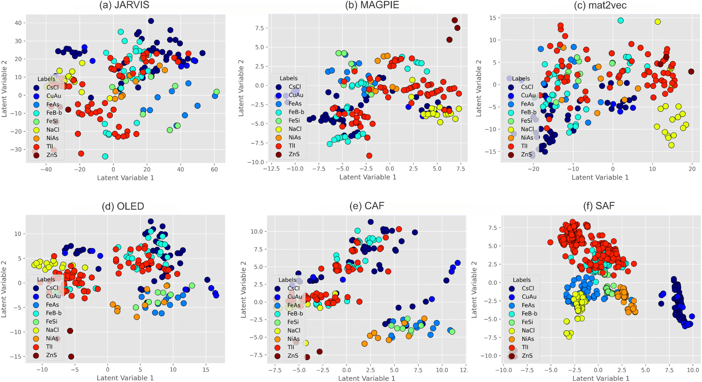
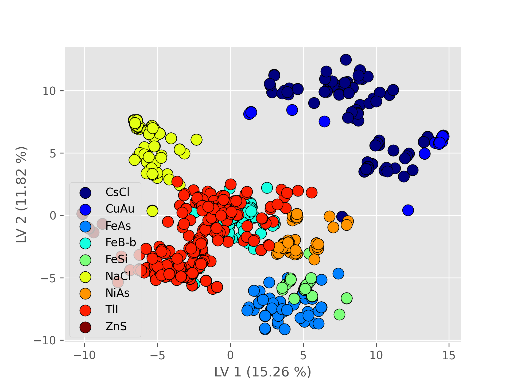
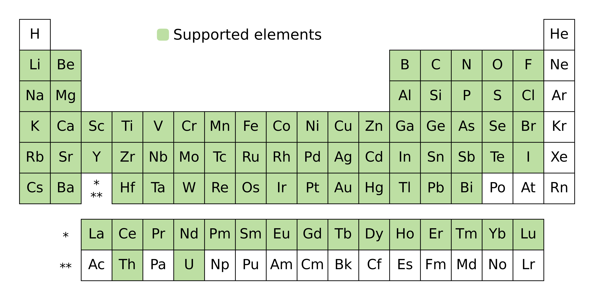

#######
|title|
#######

.. |title| replace:: Structure Analyzer/Featurizer (SAF)

.. image:: https://img.shields.io/badge/PR-Welcome-29ab47ff
   :alt: PR Welcome
   :target: https://github.com/bobleesj/structure-analyzer-featurizer/pulls
.. image:: https://img.shields.io/github/issues/bobleesj/structure-analyzer-featurizer
   :alt: GitHub issues
   :target: https://github.com/bobleesj/structure-analyzer-featurizer/issues
.. image:: https://img.shields.io/pypi/v/structure-analyzer-featurizer
   :alt: PyPI
   :target: https://pypi.org/project/structure-analyzer-featurizer/
.. image:: https://img.shields.io/pypi/pyversions/structure-analyzer-featurizer
   :alt: Python Version

| Software version |release|
| Last updated |today|.

Structure Analyzer/Featurizer (SAF) is a Python package to generate geometric features of interatomic distances, atomic environment information, and coordination numbers from a folder containing CIF (Crystallographic Information File) files.

Citation
========

If you use ``SAF`` in your scientific publication, please cite the following:

- *Digital Discovery*. `https://doi.org/10.1039/D4DD00332B <https://doi.org/10.1039/D4DD00332B>`_

as well as the ``cifkit`` package, which is the engine of ``SAF`` for coordination environment analysis:

- *Journal of Open Source Software*. `https://doi.org/10.21105/joss.07205 <https://doi.org/10.21105/joss.07205>`_

Publications and scientific utility
===================================

Structure features include interatomic distances, information on atomic environments, and coordination numbers:

- 94 binary structural features
- 134 ternary structural features
- 182 quaternary structural features

``SAF`` was originally developed to determine the coordination number and geometry for each crystallographic site in complex structures [1]_. Later, we included interactive functionality for experimentalists and data scientists to generate structural features. These features have been used as input data for ML models to predict crystal structures and their properties [2]_.

In the above `Digital Discovery <https://doi.org/10.1039/D4DD00332B>`_ paper, we describe the performance of ``SAF`` in **combination with** ``CAF`` for generating compositional and structural numerical features for ML applications in **crystal classification of binary compounds**. The results are shown in Figures 1 and 2 below, we compare the performance of our developments (SAF and CAF) with existing feature generation methods such as JARVIS, MAGPIE, mat2vec, and OLED.

.. note::
   **Figure 1:** PLS-DA latent value plot using the first two latent value dimensions: (a) JARVIS, (b) MAGPIE, (c) mat2vec, (d) OLED (all sets of features were generated with CBFV), and our developments – (e) CAF and (f) SAF.

.. note::
   **Figure 2:** SAF + CAF PLS-DA plot.

.. seealso::

   What's the differecne between ``SAF`` and ``CAF``? ``SAF`` generates structural features based on crystal structures (CIF files), while ``CAF`` generates compositional features based on chemical formulas, whileYou can learn more about ``SAF`` in https://bobleesj.github.io/composition-analyzer-featurizer/.

Publications using SAF
======================

Here is a list of publications using ``SAF`` for materials analysis and data-driven materials synthesis:

.. [1] Y. Tyvanchuk, V. Babizhetskyy, S. Baran, A. Szytula,
   V. Smetana, S. Lee, A. O. Oliynyk, A. Mudring, The crystal and electronic
   structure of RE23Co6.7In20.3 (RE = Gd–Tm, Lu): A new structure type based on
   intergrowth of AlB2- and CsCl-type related slabs. *Journal of Alloys and
   Compounds*. **4**, 548-560 (2024).
   `doi:10.1016/j.jallcom.2023.173241 <https://doi.org/10.1016/j.jallcom.2023.173241>`__

.. [2] S. S. Sethi, A. Dutta, E. I. Jaffal, N. Yadav, D. Shiryaev, B. Hoang, A. Machathi, S. Lee, K. Das, P. P. Jana, A. O. Oliynyk, Unsupervised Machine Learning Prediction of a Novel 1:3 Intermetallic Phase with the Synthesis of TbIr3 (PuNi3-type) as Experimental Validation. *Journal of the American Chemical Society*. **147**, 14739-14755 (2025).
   `doi.org/10.1021/jacs.5c03510 <https://doi.org/10.1021/jacs.5c03510>`__

Getting started
===============

We have a command-line Python application. Please visit the :ref:`getting-started` page to learn how to generate features from a folder containing ``.cif`` files.

Scope
=====

The current version supports the processing of **binary**, **ternary**, and **quaternary** ``.cif`` files containing the following elements:

.. note::

   The Pauling CN 12 radii values for some gases (``N``, ``O``, ``F``, ``Cl``, ``Br``, and ``I``) as well as ``Tc`` and ``Sm`` were interpolated using Gaussian Process Regression. The CIF radii for the aforementioned gases were compiled as averages of low-temperature structures from Persson's CIF database.

How to ask for help
===================

- Do you have any feature requests? Please feel free to open an issue on GitHub using the ``Bug Report or Feature Request`` template.
- Do you have any questions about running the code? Please feel free to reach out to Sangjoon Bob Lee at bobleesj@stanford.edu.
- Do you want to learn how to publish scientific software? ``SAF`` is developed and maintained using the Level 5 package standards provided in `scikit-package <https://scikit-package.github.io/scikit-package/>`_.

How you can contribute to SAF
=============================

- Did you find SAF helpful? You can show support by starring the `GitHub repository <https://github.com/bobleesj/structure-analyzer-featurizer>`_ and recommending it to colleagues.
- Did you find any bugs? Please feel free to report them by creating a new issue so that we can fix them as soon as possible.

.. seealso::

   Do you want to learn how to use GitHub and develop Python packages to reuse your code? Please feel free to reach out to Sangjoon Bob Lee (bobleesj@gmail.edu). There are resources you can use to get started, such as `scikit-package <https://scikit-package.github.io/scikit-package/>`_

.. image:: img/scikit-package-logo-text.png
   :alt: scikit-package logo
   :align: center
   :width: 400px
   :target: https://scikit-package.github.io/scikit-package

Contributors
============

- Anton Oliynyk - CUNY Hunter College
- Arnab Dutta - IIT Kharagpur
- Nikhil Kumar Barua - University of Waterloo
- Nishant Yadav - IIT Kharagpur
- Sangjoon Bob Lee - Columbia University
- Siddha Sankalpa Sethi - IIT Kharagpur

Acknowledgements
================

`scikit-package <https://scikit-package.github.io/scikit-package/>`_ is used to accelerate maintaining and developing this Python package. `cifkit <https://bobleesj.github.io/cifkit/>`_ is used to determine the coordination number and environment of each crystallographic site from each ``.cif`` file.

.. toctree::
   :maxdepth: 2
   :hidden:
   :caption: GUIDES

   getting-started
   features

.. toctree::
   :maxdepth: 2
   :hidden:
   :caption: REFERENCE

   Package API <api/SAF>
   release
   license
